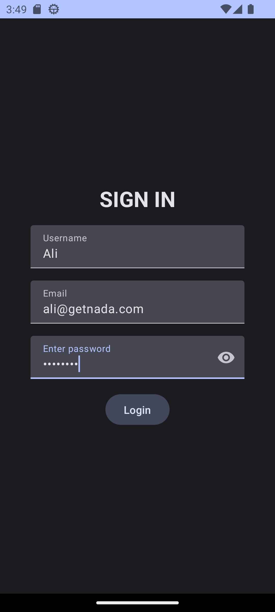
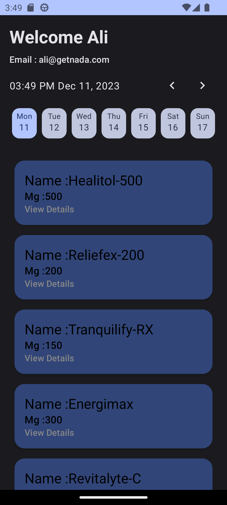
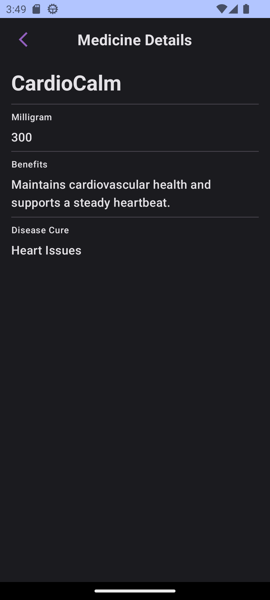

<h1 align="center">Medicine App</h1>

## Features

- **Data Retrieval:** I have successfully implemented data retrieval by fetching data from the [Mocky.io](https://run.mocky.io/v3/e5423b88-1a23-44e4-a692-9618ab87e802) using Retrofit2.
- **Architecture:** I've used the MVVM (Model-View-ViewModel) clean architecture. Additionally, a ViewModel is employed to handle user interface-related data.
- **Dependency Injection:** Hilt Dagger has been employed for dependency injection, ensuring that the code remains modular and maintainable.
- **Offline Caching:** The app features offline caching to enhance user experience by providing access to previously fetched medicine data even when the user is offline.
- **UI Design:** I've created fully functional user interface components using Jetpack Compose, including LazyColumn, Row, Column, and ConstraintLayout, to ensure a smooth and visually appealing user experience.
- **Dynamic Color Adaptation:** The app intelligently adjusts the color scheme of its UI components in real-time, harmonizing with the predominant colors of the system wallpaper.
- **Material3 Design:** Embrace the modern and intuitive Material3 design language for a seamless and user-friendly experience.
- **Navigation:** Navigation components have been integrated to facilitate seamless navigation between different screens within the app, following best practices for a single-activity, multiple-fragment architecture.

## App Preview
https://github.com/MuhammadAliGhaffar/ArlibApps/assets/55552043/f569f253-aeb4-497b-a875-2410ab484678

## Screenshots

     

